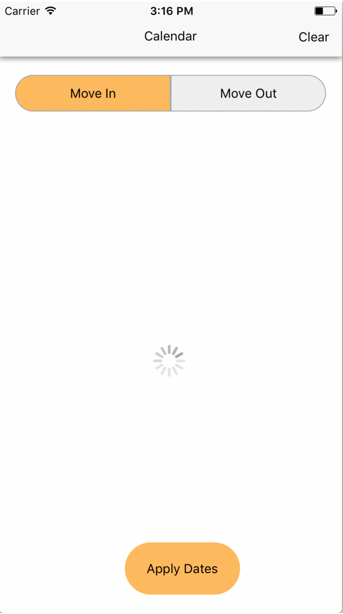

# CalendarApp
React Native Calendar App (Cross platform)

## How to run?

1. clone `git@github.com:HannanShaik/CalendarApp.git`
2. `cd CalendarApp`
3. Then install the packages with `npm install`
4. Run on Android via `react-native run-android`
    or
   Run on iOS via `react-native run-ios`
   
## Behind the scenes

1. Calendar UI - Built using `react-native-calendar` package. (https://github.com/wix/react-native-calendars)
2. Date Manipulation - Used `moment.js` (https://momentjs.com/)
3. Date Picker UI - Built using `react-native-datepicker` package. (https://github.com/xgfe/react-native-datepicker)
4. Used `eslint` for error highlighting.

Have written appropriate comments where ever required.

## Screenshots

### iOS

### Android

